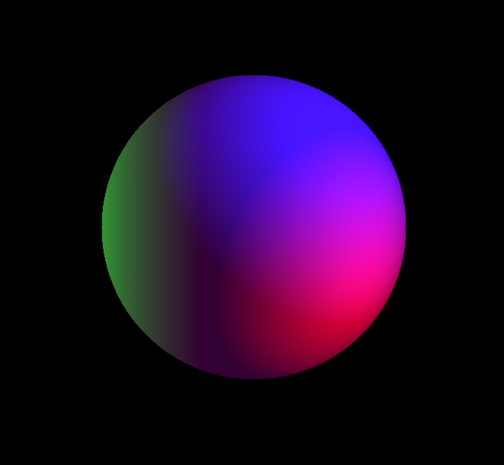

#  Sphere

<figure>

<figcaption>Сфера</figcaption>
</figure>

### Сфера освещена тремя источниками света. Пусть каждого луча рассчитан отдельно. Степень освещенности определяется по Ламберту. Отдельно рассчитывается блик.
